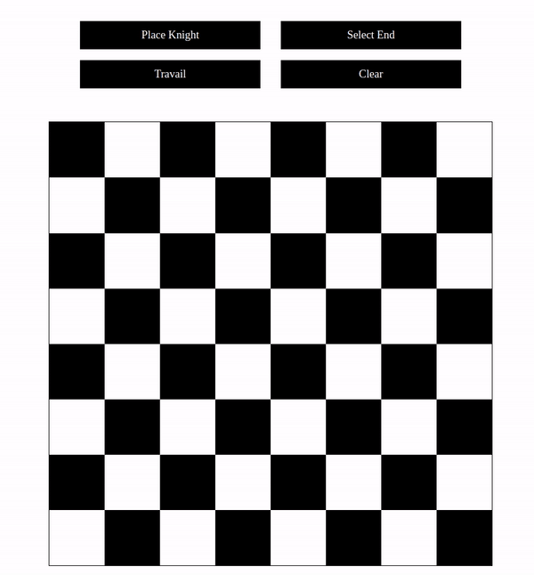

# Knights Travails

# Odin Project - weather app challange

This is a solution to Odin Projects Knights travails challange

## Table of contents

- [Overview](#overview)
  - [Screenshot](#screenshot)
  - [Links](#links)
- [What I've learned](#Learned)
- [Author](#author)

## Overview

Simple app that shows shortest path from one point to another, in this case knights move on chessboard, knights only move 2 cells in any diraction and one on side. Algorithm uses grid-graph, function to find shortest path uses breadth-first-traversal algorithm.

### Screenshot

### Links

[Click to view live site](https://gwynbleidd0014.github.io/knihts-travails/)

## Learned

I was introduced to graphs, they are pretty cool, practiced graph traversal algorithms.

## Author

Hello, I'm Ucha, you might know me as [gwynbleidd0014](https://github.com/gwynbleidd0014) on github
